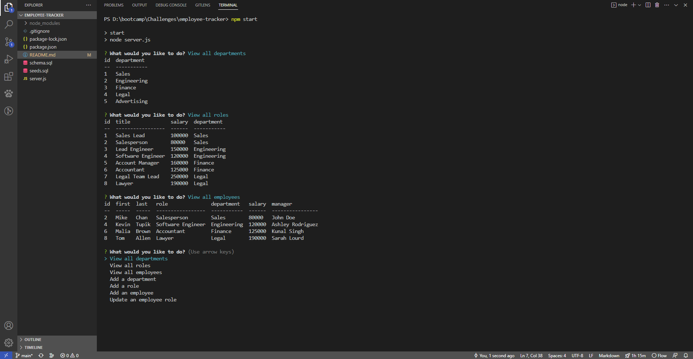

# Employee Tracker
Module 12 - SQL Challenge

## Description
This command line application allows a company to view, add, and update their departments, employees, and roles with the help of Node.js, Inquirer, and MySQL.

 ## Installation
 - Clone repository
 - Download node.js, console.table, inquirer, mysql 2 as dependencies
 - Start application with 'npm start'